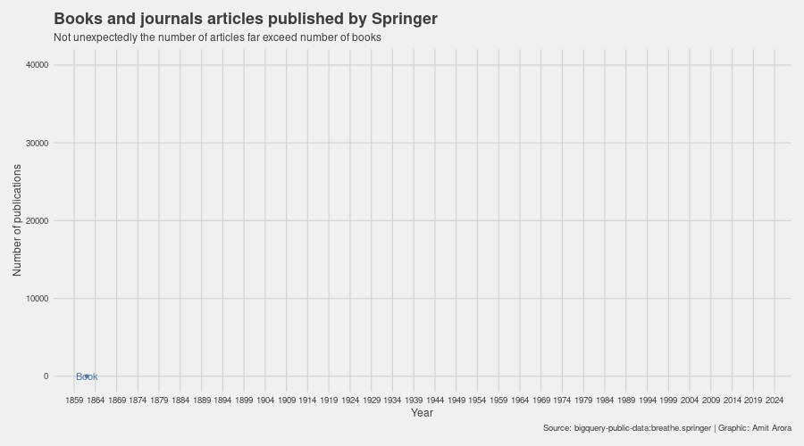
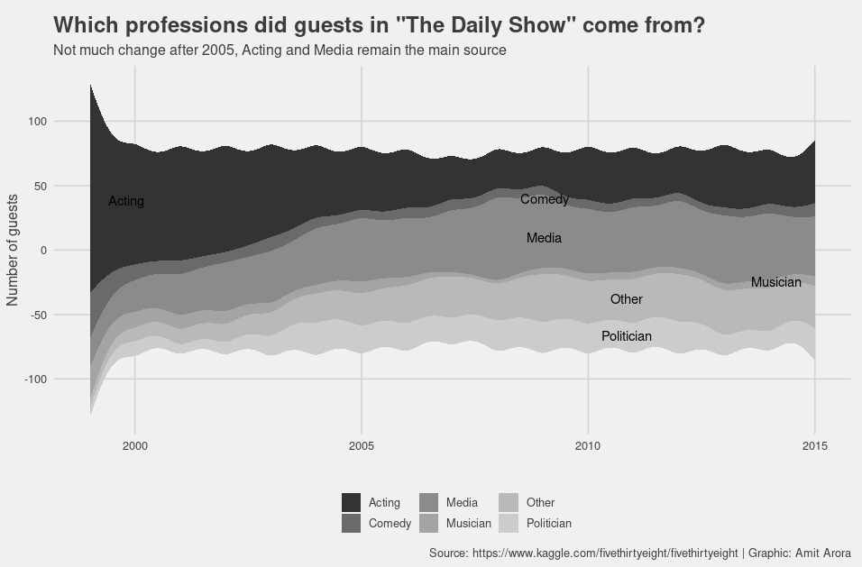

# 30 Day Chart Challenge

## Day 1: Part-to-whole

A waffle chart of squares with 10 rows and 42 columns showing the breakdown of number of days taken to lose 61lbs of weight in my weight loss journey over the past 15 months. I went from 253lb to 192lb. Each group of tens is a category i.e. the 190lb's is a category, the 200lb's is a category and so on and so forth. Each box represents 1 day spent in that weight group (a.k.a. category). The plot is able to show that it becomes progressively harder to lose weight, for example while I was in the 240s for only 18 days, I was in the 230s for almost double that time and then same for the 220s. The data is here https://github.com/aarora79/30DayChartChallenge/blob/main/01-part-to-whole/bodyweight.csv.

## Day 2: Pictogram

A pictogram for a workout I did one weekend. Made using highcharter package and icons found on the web. Each drawing of the icon equals one rep of the exercise. There were four exercises: bodyrows, burpees, pushpresses and sprints. The data is here https://github.com/aarora79/30DayChartChallenge/blob/main/02-pictogram/workout.csv.

## Day 3: Historical

A historical chart showing how the names gaining popularity in the decade of [2010, 2020)have fared historically. We determine the top 10 male and female names and draw a timeseries chart of how popular these names have been historically since the 1910s. The data for this analysis is available in BigQuery public dataset collection (usa_names) and is not being checked in as part of this repo. We find that same of the names gaining fastest in popularity were also popular in the early 1900s. Names such as EVelyn and Charlotte for females and Henry and Leo are back in favor. A name that stands out is 'Liam' for its very distinct rise (that still continues) since the 1990s.

## Day 4: Magical

A couple of charts about the TV Series "Just Add Magic". The wordcloud shows it is about three friends who cook spells from their grandma's cookbook. The network graph shows summarizes the season using bigrams from episode summaries. Season 1 and 3 have little in common except for "Saffron Falls" the place where the show takes place, Season 2 and 3 have the common theme of the girls cooking spells.

 

## Day 5: Slope

A slope chart showing body composition changes (weight, lean mass, BMI) with diet and exercise of a 14 month period. More such charts and data in my book \"Blueberries In My Salad: My Journey Towards Fitness & Strength\" (Amazon: https://www.amazon.com/Blueberries-My-Salad-Journey-Strength-ebook/dp/B08KPMGT4W, LeanPub: https://leanpub.com/blueberries-in-my-salad/c/4Pe65eVXFLx3). Please show some love to a first time author :-).

## Day 6: Experimental

Experimented with a bullet chart for the first time (thank you: https://themockup.blog/posts/2020-11-29-bullet-chart-variants-in-r/). The chart shows my progress towards my deadlift target (what it does not show: took 15 months to get to a 315lb deadlift).

## Day 7: Physical

What is more physical than lifting 300lb off the ground or carrying 250lb for 30 steps? Here is a chart showing the distribution of the pounds I deadlifted over the past 14 months. Made using the wonderful <a href=https://cran.r-project.org/web/packages/ggridges/vignettes/gallery.html>ggridges</a> package.

## Day 8: Animals

Do the last 5 letters of a dinosaur species name give a clue about their diet? This simple bar chart faceted by the suffix helps answer this question. Seems like the most common suffix "sauras" has the most diverse diet as a species, followed by raptor's and pteryx'es.

## Day 9: Statistics

An attempt to model number of days spend at each weight during my weight loss journey. Start with visualizing the the data (number of days spent at each weight) using histogram, density plot and empirical CDF and then observe that the distribution looks like a long tailed distribution. Model the distribution using the \"[fitdistrplus](https://cran.r-project.org/web/packages/fitdistrplus/vignettes/paper2JSS.pdf)\" package as a Weibull, Gamma and Log Normal distribution. Plot the goodness of fit plots. Seems like the Log Normal fits the empirical distribution the best as observed from the CDF plots. For a change, plot the charts in base R rather than ggplot2.

## Day 10: Abstract

Using a t-SNE plot to see if it can separate out classes in a high dimensional imbalanced dataset. The dataset used here contains anonymized credit card transactions made over 2 days in September 2013 by European cardholders, with 492 frauds out of 284,807 transactions. It is available as part of the BigQuery public datasets, please see bigquery-public-data:ml_datasets.ulb_fraud_detection. 

The closeness of the points representing the fraud transactions show how t-SNE can reveal structures in high dimensional data!

Data originally from: Andrea Dal Pozzolo, Olivier Caelen, Reid A. Johnson and Gianluca Bontempi. Calibrating Probability with Undersampling for Unbalanced Classification. In Symposium on Computational Intelligence and Data Mining (CIDM), IEEE, 2015.

## Day 11: Circular

Which licenses are most commonly used for which languages in open source repositories in GitHub? We try to find the answer by looking at the top 10 languages corresponding to the top 5 open source licenses used in GitHub. C/C++ find a place in the top 10 list for all licenses except for MIT, and also MIT seems to be the license of choice for most of the open source repositories with Javascript, CSS, HTML and other web programming languages forming the bulk of the repos.

Data Source: BigQuery Public Data: bigquery-public-data.github_repos

## Day 12: Strips

Visualizing the number of Starbucks stores per city across the top 10 countries with the most Starbucks stores (as of 2017) using a strip plot. Each point represents a city and the x-axis represents number of stores in a city. The U.S. has the most Starbucks stores by a long margin and also the most cities with more than 25 stores per city. Other than the Canada, Mexico and the U.K. all other countries are in Asia, nothing in Europe (this data is from an [old dataset](https://raw.githubusercontent.com/chrismeller/StarbucksLocations/master/stores.csv)).

## Day 13: Correlation

Higher the prevalence of obesity in a population, lower the life expectancy. Each point in this chart represents a U.S, county, data from [Institute for Health Metrics and Evaluation (IHME)](http://www.healthdata.org/), [this link](http://www.healthdata.org/sites/default/files/files/data_for_download/alcohol_life_expect/IHME_county_data_LifeExpectancy_Obesity_PhysicalActivity_NATIONAL.xlsx). A simple scatter plot with trend line is able to show the clear negative correlation.

## Day 14: Space

Exploring the Exoplanets. There are lots of them! Most of the Exoplanets are within 2500 parsec distance of the sun and surface temperature less than 2000 Kelvin. The largest Exoplanet **KOI-3617 b** is far away and hot, the smallest Exoplanet **KOI-2867 c** is close(er) and cool(er).

Data source: [Open Exoplanet Catalogue Tables](https://github.com/OpenExoplanetCatalogue/oec_tables)

## Day 15: Multivariate

The census income dataset contains a number of categorical variables that lend themselves beautifully to train a classifier model. This chart explores relationship in multivariate data using parallel coordinates.

Data source: Bigquery Public Datasets, Census Income, bigquery-public-data:ml_datasets.census_adult_income

## Day 16: Trees

Classify wheat kernels using a decision tree. A decision tree chart that using only two features i.e. area and length of the kernel groove we can achieve pretty good classification. A treemap is used to plot the decision boundary of a classifier built using these two features.

Data source: https://raw.githubusercontent.com/jbrownlee/Datasets/master/wheat-seeds.csv

## Day 17: Pop Culture

Use wordcloud to get an idea of Netflix TV show content in India and the US. Some common themes such as family, friends, life and love occur in shows in both countries. A lot of words pointing to many different genres occur in the Netflix shows in the U.S., not so much in India. Used the ggwordcloud and patchwork packages for the first time.
Data source: https://www.kaggle.com/shivamb/netflix-shows

## Day 18: Connections

Use a chord diagram to visualize the number of times the 10 most frequently appearing characters in GoT appear together in a scene. Interestingly Tyrion has a lot of scenes with the top 10 characters, while Arya has very few. Jon and Daenerys have a lot of scenes but Daenerys primarily has scenes with Jorah, Jon and Tyrian. The siblings Cersei, Jamie and Tyrian have a lot of scenes with each other but the siblings Sansa, Arya and Bran have much fewer which makes sense based on the story.

Data source: https://raw.githubusercontent.com/jeffreylancaster/game-of-thrones/master/data/episodes.json

## Day 19: Global Change

Visualizing internet usage as a percentage of population for the top 10 most populous countries. The world average since the late 1990s is almost linear, with the Americas being above the average and the Asian countries except China and the one African country in the list (Nigeria) being below the world average. Brazil and China have seen a remarkable growth in Internet usage. For some reason after 2017 the internet usage in the Indian subcontinent either decreased or stagnated.

Data source: https://data.worldbank.org/indicator/IT.NET.USER.ZS

## Day 20: Upwards

My deadlift journey from 0 (almost) to 315 lb (still continuing). A timeseries of box plot for deadlifts done over the last 15 months. Journey to 315 lb was'nt easy but the path to 400 lb is a different game altogether. More such charts in my book [Blueberries in my salad: my journey towards fitness & strength]( https://leanpub.com/blueberries-in-my-salad).

## Day 21: Downwards

My weight loss journey from 253lb to 190lb (still continuing). Spread across 15 months, the downwards trending line chart reflects weight measurement done every single day, lays bare all the ups and downs. Consistency rather than intensity! More such charts in my book [Blueberries in my salad: my journey towards fitness & strength]( https://leanpub.com/blueberries-in-my-salad).

## Day 22: Animation

The number of books and journal articles published by Springer over more than 150 years as an animation. Not unexpectedly, the number of journal articles far exceed the number of books. Simple chart, just learning about gganimate.

Data Source: bigquery-public-data:breathe.springer

## Day 23: Tiles

Percentage of tags seen in Stackoverflow posts over the years. Javascript is growing and growing, same for Python, other web technologies are also quite common, Android is growing slowing and steadily. c# is past its glory days, C, C++ are declining.

Data Source: bigquery-public-data.stackoverflow.stackoverflow_posts

## Day 24: Monochrome

Which professions did guests in "The Daily Show" come from? Not much change after 2005, acting and media remain the mainstays.

Data Source: https://www.kaggle.com/fivethirtyeight/fivethirtyeight

## Day 25: Demographics

How well do people of different Asian American communities speak English? Here is the data from a survey conducted in Austin, Texas. Filipinos had the highest percentage (64.5%) of people who identified as speaking "very well" followed by Asian Indians (55.1%).

Data Source: https://data.austintexas.gov/City-Government/Final-Report-of-the-Asian-American-Quality-of-Life/hc5t-p62z

